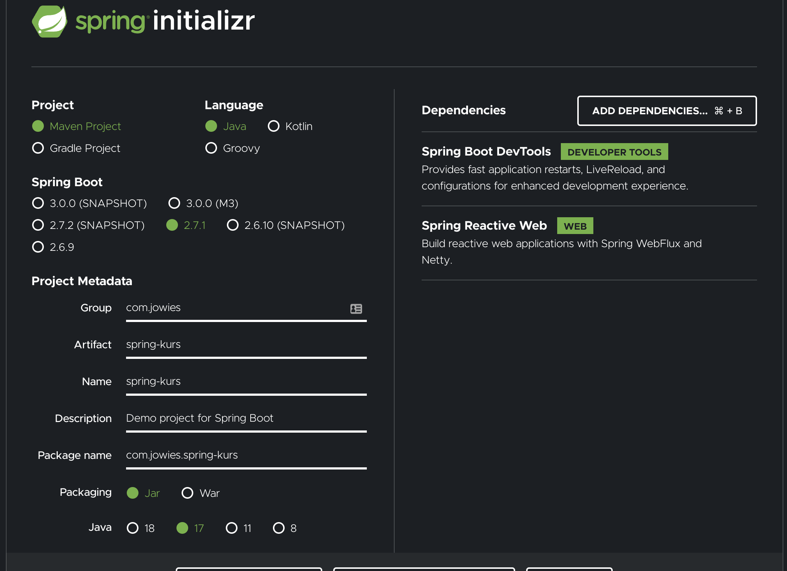

# Spring Boot med Kotlin

## Ting dere trenger på forhånd

* Java 11 eller nyere
* Maven 3.5 eller nyere

## Initialiser prosjektet

Gå inn på <https://start.spring.io/>. Spring Initializr er en løsning for kjapt genere et spring boot prosjekt. Det kan tenkes på litt som en create-react-app.

Velg følgende konfigurasjon:


1. Project: **Maven**
2. Language: **Kotlin**
3. Spring Boot: **2.4.5**
4. Project metadata: **Vær kreativ**
5. Packaging: **Jar**
6. Java: **11**
7. Dependencies:
**Spring Web**,
**Spring Data Jpa**,
**H2 Database**,
**Spring Boot DevTools**,

Last ned og extract mappen

## Første kjøring

Nå skal vi inn i terminalen. Gå til folderen som ble pakket ut. Trykk `ls` for å se innholdet. Det burde se noenlunde sånn her ut

```zsh
src/
HELP.md
mvnw
mvnw.cmd
pom.xml
```

1. **src** - Her ligger all koden var
2. **HELP.MD** - Liste over dokumentasjon og noen guider
3. **mvnw** - Kan brukes til a kjore maven pa unix-systemer. Ikke nodvendig hvis man har det installert pa pcen, men kan vare greit med tanke pa versjon
4. **mvnw.cmd** - Samme som over men for windows
5. **pom.xml** - Brukes til a konfigurere applikasjonen, definere dependencies etc.

Hvis du er på windows skriv:
```./mvnw.cmd spring-boot:run```
På unix, skriv:
```./mvnw spring-boot:run```

Forhåpentligvis kræsjer det ikke...Du kan gå til `localhost:8080`. Står det /error er du good

Jeg ville ha denne oppe hvis dere ikke er så kjent med Kotlin. Her står det meste: <https://kotlinlang.org/docs/getting-started.html>

## Første endepunkt

Åpne prosjektet i favoritteditoren din. Naviger til `src/main/.../TodoApplication.kt`
Dette er startpunktet for applikasjonen deres. Dette burde ikke se så fremmed ut hvis du er kjent med kotlin. Det er en ganske enkel klasse, med en main funksjon. Det som er interessant er egentlig ```@SpringBootApplication``` som indikerer hvor Spring skal starte applikasjonen.

Nå skal vi lage et enkelt GET-endepunkt. Lag en ny fil som heter `Controller.kt`. I den skriver dere følgende:

```kotlin
package com.jowies.example.todo

import org.springframework.web.bind.annotation.RestController
import org.springframework.web.bind.annotation.RequestMapping
import org.springframework.web.bind.annotation.GetMapping

@RestController
@RequestMapping("/list")
class TodoController() {

  @GetMapping
  fun getAllLists(): String {
    return "Hello world"
  }
}
```

Gå inn på <http://localhost:8080>. Og du burde se `Hello World`.

**Så hva skjer her?**

* `@RestController`: Denne definerer at klassen skal lastes inn av Spring til å fungere som controller der metodene alltid returner et object. Her får vi mye gratis. Blant annet blir det automatisk parset til og fra JSON.

* `@RequestMapping`: Definerer hvor i URL-pathen og hva slags request som skal gjelde. I dette tilfelle vil requests mot /list gå mot denne controlleren.

* `@GetMapping`: Shorthand for `@RequestMapping(method=GET)`

### Få på litt faktisk data

Hello world er kult. Men det hadde vært kulere hvis vi faktisk fikk noe data. Enig! La oss begynne med å definere hvordan dataen vår skal se ut.

Lag filen `Entities.kt`. Skriv følgende:

```kotlin
package com.jowies.example.todo

import java.time.LocalDateTime
import javax.persistence.*

@Entity
data class TodoList(
        var name: String,
        var description: String,
        var created: LocalDateTime = LocalDateTime.now(),
        @Id @GeneratedValue var id: Long? = null
)
```

* `@Entity`: Indikerer at dette er en JPA-entity. JPA står for Java Persistence API. Definert av java for persistent lagring.

* `@Id`: Gjør at JPA gjenkjenner dette feltet som ID'en til objektet

* `@GeneratedValue`: Indikerer at ID'en skal genereres automatisk

Vi trenger å lagre dataen et sted. Vi sette ikke opp en database, men bruker H2 til å få en in-memory database.

Lag filen `Repositories.kt`. Skriv følgende:

```kotlin
package com.jowies.example.todo

import org.springframework.data.repository.CrudRepository

interface TodoListRepository : CrudRepository<TodoList, Long> {}
```

* `CrudRepository`: Vi lager en extension av CrudRepository. Spring-magi lager en implementasjon av dette interfacet når appen starter.

Vi trenger også et sted for å kjøre applikasjon/business-logikken vår. `Entities.kt` definerer datamodellene våre, `Repositories.kt` definerer hvor vi lagrer dataen vår. Lag filen `Service.kt`:

```kotlin
package com.jowies.example.todo

import org.springframework.stereotype.Service

@Service
class TodoListService(
    val todoListRepository: TodoListRepository
) {

  fun getAllLists(): List<TodoList> {
    return todoListRepository.findAll().toList()
  }
}
```

* `@Service`: Markerer en klasse som at den har ansvar for business-logikk. Spring ser denne og kan injecte den andre steder i appen. Som neste kodesnutt viser.

Boom! Da har vi det vi trenger. La oss gå tilbake til `Controller.kt`. Her vil vi nå legge til servicen vår. Spring bruker constructor injection til å legge til servicen.

```kotlin
...
class TodoController(val todoService: TodoListService) {

  @GetMapping
  fun getAllLists(): List<TodoList> {
    return todoService.getAllLists()
  }
}
```

Nice! Da må vi vel være der? Ish. Vi har jo ikke noe data å hente. Det trenger vi. La oss legge til noe data når appen starter. I `TodoApplication.kt` legg til følgende:

```kotlin
class TodoApplication {

  @Bean
  fun run(todoListRepository: TodoListRepository) =
      ApplicationRunner {
        todoListRepository.save(TodoList(name = "Hverdag", description = "Gjoremal i hverdagen"))
      }
}
```

Her bruker vi `ApplicationRunner`. Den er annotert med en `@Bean` og blir brukt i `@SpringBootApplication`. Da vil spring registrere og kjøre den. `TodoListRepositoriet` blir injected. Og vi bruker metoden `save` for å lagre et *TodoList*-objekt

Faen ja! Endelig kan vi gjore et ordentlig request. Gå inn i Postman last ned og importer TodoKurs.postman.json. Og trykk send på *GetAll*-requestet!

Yeeey! Dataen blir initialisert og vi henter den med et GET-request!

## Av med støttehjulene

Nå har vi lagd byggeklossene for kjapt kunne legge til ny funksjonalitet. Nå fjerner vi støttehjulene og dere får noen oppgaver. Hver oppgave gir dere det dere trenger for å løse den. Hvis dere står fast kan dere bruke eksempelet i *example*-mappen over som veiledning. Bruk Goodle for alt det er verdt, men ikke bare copy-paste, prøv å forstå koden.

### Oppgave 1 - Legge til data

I denne oppgaven skal dere lage et POST-request for å lagre dataen. Dere trenger kun å endre ting i følgende filer:

* `Controller.kt`: Her vil dere trenge `@PostMapping` og `@RequestBody`
* `Service.kt`: Her trenger dere kun `todoListRepository.save`

Bruk postman-requestet som heter Create for å teste endepunktet. Bruk getAll for å sjekke om du fikk lagret todolisten.

Tips 1: Man bruker `@RequestBody` foran en parameter i en funksjon
Tips 2: Tenk over hva en funksjon skal få inn og hva den skal returnere

### Oppgave 2 - Hente én ting

I denne oppgaven skal dere lage et GET-request for å hente én todolist. Dere trenger kun å endre ting i følgende filer:

* `Controller.kt`: Her vil dere trenge `@GetMapping{/{id})` og `@PathVariable`
* `Service.kt`: Her trenger dere `todoListRepository.getById`

Bruk Postman for å sjekke om det funker

Tips 1: `@PathVariable` brukes likt som `@RequestBody`, men gir deg parametere i URL'en.
Tips 2:`orElse(null)` kan brukes etter `getById` for å gjøre en Java Optional<> til en Kotlin nullable.
Tips 3: `?:` kalles en elvis operator. Hvis noe er null vil det til høyre returneres. Ellers vil det til venstre
Tips 4: Det er greit å throwe noen type exceptions i spring. `ResponseStatusException` kan anbefales der

### Oppgave 3 - Slette

I denne oppgaven skal dere lage et DELETE-request for å slette dataen. Dere trenger kun å endre ting i følgende filer:

* `Controller.kt`: Her vil dere trenge `@DeletMapping{/{id})` og `@PathVariable`som i forrige eksempel
* `Service.kt`: Her trenger dere `todoListRepository.deleteById`

Bruk Postman for å sjekke om det funker

### Oppgave 4 - Oppdatere

Har dere kommet dere så langt burde neste være plankekjøring. Neida. Prøv å lag et PUT-request for å endre navnet til en allerede eksisterende TodoList.

### Ferdig

De vanlig REST-requestene er dekket. Neste steg vil være å lage en items entity. Så man faktisk kan legge til ting i todolistene.
